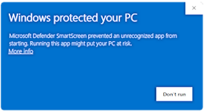

# XMirror

FREE AirPlay to your Windows PC. \
Free as both in "freedom" and "free beer"!

## Installation

Download the latest version of XMirror from [**releases**](https://github.com/MadBlast0/XMirror/releases/latest).

After installing, control XMirror from its [tray icon](https://www.odu.edu/sites/default/files/documents/win10-system-tray.pdf)! Right-click it to start or stop AirPlay. \
You can also set it to run automatically when your PC starts.

> [!IMPORTANT]
> *Why is Windows Defender complaining during installation?*
>
> 
>
> Just click on `More info` and it will let you install. It complains because the executable is not signed. If you don't trust this software you can always build it yourself! See below.
>
> If prompted by Windows Firewall, please **allow** XMirror to ensure it functions properly.

<br>
<details>
<summary><strong>Building</strong></summary>

*How do I build this software myself?*

Please see [BUILDING.md](./docs/BUILDING.md)
<br>
</details>

<details>
<summary><strong>Advanced configuration</strong></summary>

<br>

Streaming engine arguments are read from `arguments.txt`.

Configuration precedence:

1. `%ProgramData%\XMirror\arguments.txt`
2. `%APPDATA%\MadBlast\XMirror\arguments.txt`
3. built-in default

The machine-wide file takes precedence when it exists, allowing administrators
to enforce a shared configuration. When it is absent, each user can maintain
their own configuration under `%APPDATA%`.

Environment variables are expanded when the app starts. For example:

```text
-n %COMPUTERNAME% -nh
```

</details>

<details>
<summary><strong>Local development (x64 and ARM64)</strong></summary>

<br>

After installing MSYS2, the complete local build is one PowerShell command:

```powershell
.\build.ps1 package -Architecture x64
.\build.ps1 package -Architecture arm64
```

Each command produces a verified portable ZIP and MSI under the corresponding
`out\<architecture>\artifacts` directory. See the [developer
guide](./docs/DEVELOPERS-GUIDE.md) for prerequisites and additional commands.

</details>

<details>
<summary><strong>TODO</strong></summary>

<br>

- make an update checker
- codesign release builds

</details>

<details>
<summary><strong>Known Issues</strong></summary>

<br>

- Sometimes just after connecting the iPhone to XMirror, the stream appears
  but frozen. Reconnecting a second time fixes this.

</details>

## Reporting Issues

Please report issues related to XMirror on the
[issue tracker](https://github.com/MadBlast0/XMirror/issues). For issues
related to bundled third-party components, report them in their respective
repositories.

## License

XMirror is licensed under the GNU General Public License v3.0 (GPLv3), and
bundles third-party components under their own licenses. \
Please take a look at the [LICENSE](./docs/LICENSE.rtf).
